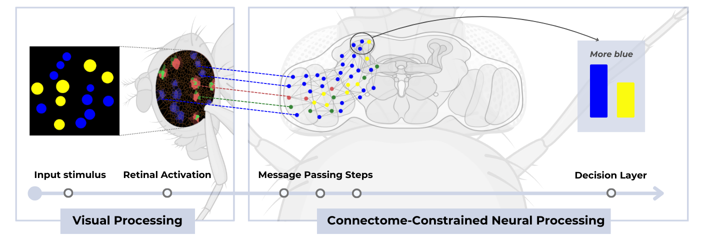
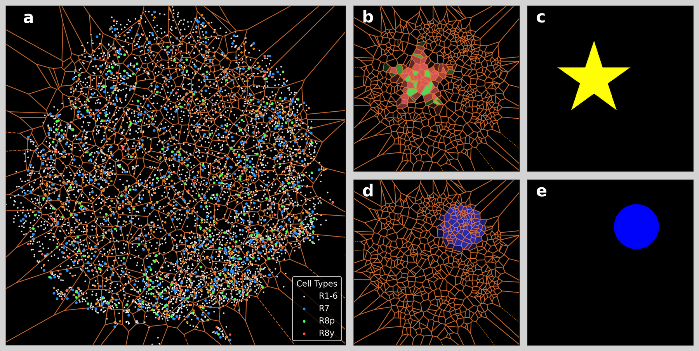
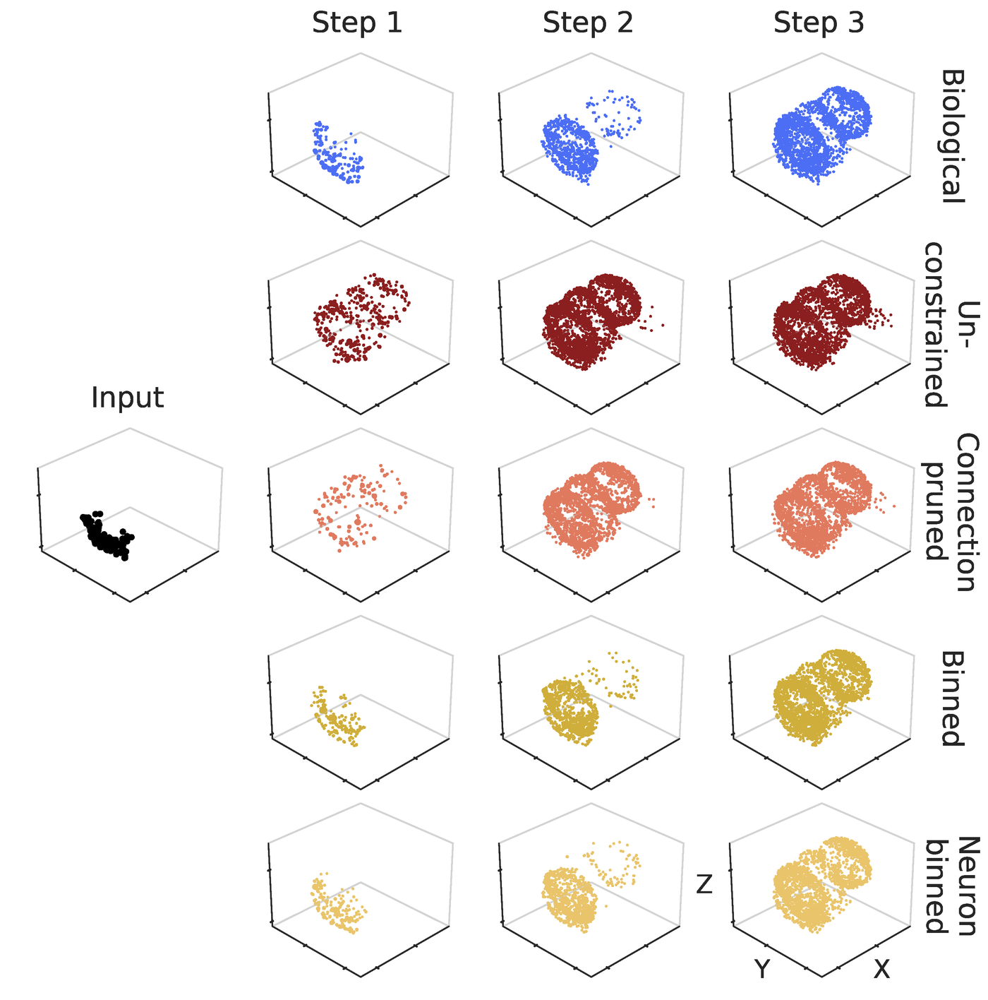
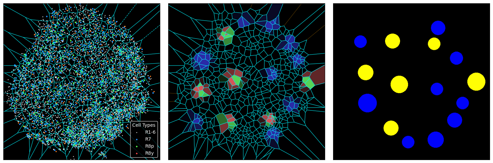
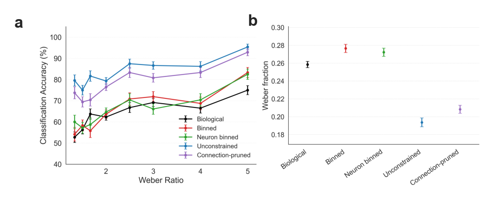

# train-your-fly

**Turn the fruit fly connectome into a trainable vision model.**

`train-your-fly` couples the proofread FlyWire whole-brain connectome of *Drosophila melanogaster* to an anatomically faithful model of its compound eye, and wraps the result as a PyTorch Geometric model that you can train on image-classification tasks. The wiring diagram never changes. What is learned is one scalar gain per synapse, optionally one threshold per neuron, and a linear readout from the Kenyon cells of the mushroom body.



It is the core model and training infrastructure behind *Structure alone supports efficient visual computation in the Drosophila visual system* (Eudald Correig-Fraga, Roger Guimerà, and Marta Sales-Pardo). The study-specific experiments, the randomized-connectome ensembles, and the paper figures live in the companion [connectome](https://github.com/eudald-seeslab/connectome) repository. The stimuli come from [cogstim](https://github.com/eudald-seeslab/cogstim).

> **Note:** this library was extracted from the companion repository and is still being decoupled from it. Some leftover code and configuration parameters remain; they will be cleaned up over time.

## Installation

Python 3.10 or newer. PyTorch and PyTorch Geometric are not installed automatically: pick the wheels for your CUDA version following the [PyTorch](https://pytorch.org/get-started/locally/) and [PyG](https://pytorch-geometric.readthedocs.io/en/latest/install/installation.html) instructions; `torch-scatter` and `torch-sparse` are required. The companion paper used `torch==2.6.0`, `torch-geometric==2.6.1`, `torch-scatter==2.1.2`, and `torch-sparse==0.6.18`. Then:

```bash
git clone https://github.com/eudald-seeslab/train-your-fly.git
cd train-your-fly
pip install -e .
```

Weights & Biases support is optional: `pip install -e ".[wandb]"`.

## Quick start

```python
from trainyourfly import Config, train, evaluate

config = Config(data_dir="my_data", num_epochs=10)
result = train(config)
accuracy = evaluate(result)
```

That's it. `result` contains the trained model, the data processor (eye model plus connectome graph), the training history, and the config.

You can customise the optimizer, the loss, or plug in experiment tracking:

```python
from torch import nn

result = train(
    config,
    criterion=nn.CrossEntropyLoss(label_smoothing=0.1),
    tracker=my_tracker,  # WandBTracker, CSVTracker, etc.
)
```

See `quickstart.ipynb` for an interactive tutorial or `examples/` for complete scripts.

## Data you need

Two kinds of data are needed: the connectome, and the images used for training and testing.

### Connectome data

The connectome data (~1.3 GB) is downloaded automatically into `connectome_data/` on first run. You can also download it manually from the [releases page](https://github.com/eudald-seeslab/train-your-fly/releases/latest) and unzip it there, or point `connectome_data_dir` somewhere else.

| File | Contents |
| --- | --- |
| `connections.csv` | `pre_root_id`, `post_root_id`, `syn_count` for every connected neuron pair (FlyWire v783 proofread connections) |
| `classification.csv` | `root_id`, `cell_type`, `side` for every neuron (FlyWire annotations v2.1.0) |
| `right_visual_positions_all_neurons.csv`, `left_visual_positions_all_neurons.csv` | Photoreceptor identities of each eye and their projected `x_axis`, `y_axis` coordinates |
| `rational_cell_types.csv` | Readout cell types, only needed when `rational_cell_types = None` |
| `connections_random_<strategy>.csv` | Optional randomized graphs, selected with `randomization_strategy` |

The connectome data is derived from [FlyWire](https://flywire.ai/). The exact biological and randomized graphs used in the paper, the annotation table, and the photoreceptor mapping are archived on Zenodo at [10.5281/zenodo.21549559](https://doi.org/10.5281/zenodo.21549559) (CC BY 4.0). Building them from the raw FlyWire release is documented in the [connectome](https://github.com/eudald-seeslab/connectome) repository. Please cite the original FlyWire work when using this data (see [Citation](#citation)).

### Train/test images

Stimuli are plain PNG folders, one subfolder per class, under `train/` and `test/`. Point `data_dir` at the folder that contains them:

```
my_data/
├── train/
│   ├── class_a/
│   │   ├── img001.png
│   │   └── img002.png
│   └── class_b/
│       └── ...
└── test/
    ├── class_a/
    │   └── ...
    └── class_b/
        └── ...
```

[cogstim](https://github.com/eudald-seeslab/cogstim) produces them in one command. For example, for approximate-number-system images:

```bash
pip install cogstim
cogstim ans --ratios easy --train-num 100 --test-num 40
```

## How it works

**1. An eye reconstructed from the connectome.** The 3D positions of the roughly 8,000 photoreceptor terminals (R1-6, R7, R8) of one eye are projected onto a plane, and a Voronoi tessellation seeded at the R7 positions gives one catchment region per ommatidium. Every 512×512 input image is averaged inside each region, so the model sees the world at the fly's angular resolution.



*Left: photoreceptor terminals of the right eye and their Voronoi tessellation. Middle: the tessellation activated by the stimuli on the right. A yellow star drives the green- and red-sensitive R8 receptors, and a blue disc drives the UV-sensitive R7 receptors.*

**2. Spectral channels.** Each photoreceptor reads the colour channel that matches its spectral sensitivity, shifted from the fly's UV-centred range into RGB: R7 reads blue, R8p reads green, R8y reads red, and R1-6 read overall luminance. Mutual inhibition between R7 and R8 can be switched on with `inhibitory_r7_r8`.

**3. Message passing over the connectome.** Neurons are nodes and directed edges carry synapse counts $e_{ji}$. For $K$ steps, each neuron sums the activity of its presynaptic partners, weighted by the synapse count and a learned gain, and applies a nonlinearity:

$$x_i^{(k)} = \gamma\Big(\sum_{j \to i} x_j^{(k-1)}\, e_{ji}\, \omega_{ji} - \xi_i\Big), \qquad \omega_{ji} = \tanh(\theta_{ji}) \in [-1, 1].$$

Neurons keep no state between steps: each step is computed from incoming input alone. Three steps (`NUM_CONNECTOME_PASSES`) are enough for retinal activity to reach the mushroom body.



*3D positions of the neurons active after each message-passing step, for the biological graph and four randomized wirings (figure from the companion study).*

**4. Readout.** After the last step, the activity of the Kenyon cells (by default `KCapbp-m`, `KCapbp-ap1`, and `KCapbp-ap2`) is averaged, or fed neuron by neuron to a linear layer, and passed to a linear classifier.

## What gets trained

| Regime | `train_edges` | `train_neurons` | Learned parameters |
| --- | --- | --- | --- |
| Classifier only | `False` | `False` | Linear readout |
| Edges only (paper default) | `True` | `False` | One gain $\theta_{ji}$ per directed connection, plus readout |
| Thresholds only | `False` | `True` | One threshold $\xi_i$ per neuron, plus readout |
| Edges + thresholds | `True` | `True` | Both, plus readout |

The normalisation and the activation function are applied at every pass when the thresholds are trained, or with `activate_neurons = True` (thresholds of zero); otherwise a pass is the weighted sum alone. With the raw synapse counts that sum multiplies the activity by hundreds to thousands at every step; `neuron_normalization = "mean"` is a global gain per brain that holds it at the same level from step to step, whatever the stimulus, and unlike `min_max` it keeps the sign of every input and is not set by the two most extreme neurons.

With `synaptic_limit = True`, the gains are squashed with `tanh` into [-1, 1], so a synapse can become excitatory or inhibitory. With `refined_synaptic_data = True`, the synapse counts carry their neurotransmitter sign and the gains are squashed with a sigmoid into [0, 1] instead.

## Configuration

The easiest way to configure your experiments is with a YAML file:

```python
from trainyourfly import Config

# Create an example config.yaml with all parameters documented
Config.create_example("config.yaml")

# Edit the file, then load it
config = Config.from_yaml("config.yaml")
```

You can also create a config directly in Python:

```python
config = Config(data_dir="my_data", batch_size=16, num_epochs=50)

# Save your config for reproducibility
config.to_yaml("my_experiment.yaml")
```

### Configuration reference

The options that change the model. See the generated `config.yaml` for the full list with descriptions.

| Option | Default | Meaning |
| --- | --- | --- |
| `data_dir` | `"data"` | Folder with `train/` and `test/` subfolders |
| `connectome_data_dir` | `"connectome_data"` | Folder with the connectome CSVs (downloaded on first run) |
| `batch_size` / `num_epochs` / `base_lr` | `8` / `100` / `0.0003` | Training hyperparameters (AdamW by default) |
| `NUM_CONNECTOME_PASSES` | `3` | Message-passing steps |
| `train_edges` / `train_neurons` | `True` / `False` | Learn synaptic gains / neuronal thresholds |
| `activate_neurons` | `False` | Normalise and activate at every pass even without trained thresholds (`train_neurons` implies it) |
| `neuron_normalization` / `normalization_scale` | `"min_max"` / `3.0` | Normalisation of the neurons' input before the activation: `min_max`, `log1p`, or `mean` (each brain's input divided by `normalization_scale` times its mean absolute value) |
| `synaptic_limit` | `True` | Bound the gains with `tanh` (a sigmoid with signed data) |
| `refined_synaptic_data` | `False` | Use neurotransmitter-signed synapse counts |
| `randomization_strategy` | `None` | Load `connections_random_<strategy>.csv` instead of the biological graph |
| `eye` | `"right"` | Which eye's photoreceptors seed the tessellation |
| `voronoi_criteria` | `"R7"` | Seed cells at R7 terminals, or `"all"` for random seeds regenerated every batch |
| `rational_cell_types` | three Kenyon-cell types | Readout populations |
| `final_layer` | `"mean"` | Average the readout population, or `"nn"` for one weight per readout neuron |
| `num_decision_making_neurons` | `None` | Read out from a random subset of that size |
| `filtered_celltypes` / `filtered_fraction` | `[]` / `None` | Drop cell types, or keep only this fraction of non-protected neurons (`None` keeps all) |
| `neuron_dropout` / `decision_dropout` | `0` / `0` | Dropout on synaptic messages / on the readout |
| `inhibitory_r7_r8` | `False` | R7 and R8 inhibit each other inside an ommatidium |
| `log_transform_weights` | `False` | Use `log1p(syn_count)` as the edge weight |
| `min_synapses` | `None` | Drop connections with fewer synapses (summed per neuron pair); FlyWire's convention is `5` |

Photoreceptors and the readout cell types are protected and can never be filtered out.

## Experiment tracking

The library is agnostic to the experiment tracking tool you use. An `ExperimentTracker` protocol defines the interface that any tracker must satisfy:

```python
class ExperimentTracker(Protocol):
    def initialize(self, config) -> None: ...
    def log_metrics(self, epoch, loss, accuracy, *, task=None) -> None: ...
    def log_image(self, figure, name, title, *, task=None) -> None: ...
    def log_dataframe(self, df, title) -> None: ...
    def log_validation(self, loss, accuracy, results_df, plots, *, task=None) -> None: ...
    def finish(self) -> None: ...
```

Pass any tracker that implements these methods to the training function. By default a `NullTracker` is used (no tracking).

### Using Weights & Biases

Install the optional dependency and use the built-in `WandBTracker`:

```bash
pip install train-your-fly[wandb]
# or: pip install wandb
```

```python
from trainyourfly.integrations.wandb_tracker import WandBTracker

tracker = WandBTracker(project="my-fly-project", group="experiment-1")
train(config, tracker=tracker)
```

See `examples/training_with_wandb.py` for a full script.

### Writing your own tracker

You can integrate any tracking tool (MLflow, TensorBoard, CSV files, ...) by implementing the same methods. See `examples/training_with_csv_logger.py` for a complete example that writes metrics to a CSV file and saves plots to disk:

```python
class CSVTracker:
    def initialize(self, config):
        self._file = open("metrics.csv", "w")
        # ...

    def log_metrics(self, epoch, loss, accuracy, *, task=None):
        self._file.write(f"{epoch},{loss},{accuracy}\n")

    def log_image(self, figure, name, title, *, task=None):
        figure.savefig(f"images/{title}_{name}.png")

    def finish(self):
        self._file.close()
```

## Looking inside

The package gives you the hooks; what you look at is up to you. The two plots below are examples, and the companion [connectome](https://github.com/eudald-seeslab/connectome) repository shows many more uses of the same model: randomized wirings, how far activity travels at each message-passing step, which neurons and cell types drive a decision, and the geometry of the Kenyon-cell representation.

`DataProcessor.plot_input_images(image)` returns the three-panel diagnostic below, which `train()` logs to the tracker at the start of every epoch: the tessellated retina, the photoreceptors activated by the current image, and the image itself.



After testing, `plot_results` in `trainyourfly.plots.plots` turns a results table into task-specific plots, and `guess_your_plots(config)` picks them from the class names: accuracy by Weber ratio and by colour for dot arrays, by radius and distance for shapes, a contingency table for multi-class tasks.



*Task accuracies from the companion study for the biological connectome and four randomized wirings: colour discrimination, shape recognition, numerical discrimination, and accuracy as a function of the Weber ratio between the two dot counts.*

In evaluation mode, `FullGraphModel` also keeps the Kenyon-cell activity of the last batch in `model.intermediate_output`. That vector is the model's internal representation of the stimulus. The companion repository captures it for every test image with a forward hook and reduces it with t-SNE, UMAP, or PCA to look at [representation manifolds](https://github.com/eudald-seeslab/connectome#looking-inside-the-model).

## Using the eye and the graph outside training

The pieces that `DataProcessor` assembles can also be used on their own, for instance to drive many connectome brains at once with a single sparse matrix instead of PyTorch Geometric batches.

**Connectivity as a sparse matrix.** `GraphBuilder.from_dataset(...)` (or `GraphBuilder.from_neuron_data(...)`) annotates every node, in `root_ids.index_id` order, and can hand out the wiring as a CSR tensor:

```python
import torch

from trainyourfly import Config
from trainyourfly.connectome_models.graph_builder import GraphBuilder
from trainyourfly.utils.csv_loader import CSVLoader

config = Config(min_synapses=5, device_type="cuda")
gb = GraphBuilder.from_dataset(
    data_dir=config.CONNECTOME_DATA_DIR,
    csv_loader=CSVLoader(),
    rational_cell_types=config.rational_cell_types,
    config=config,
)

gb.cell_type_names        # sorted unique cell types ("Unknown" included when present)
gb.node_cell_type         # int array [num_nodes], index into cell_type_names
gb.node_side              # int array [num_nodes]: 0 left, 1 right, 2 centre / na / unknown
kc_left = gb.node_indices_for_types(["KCapbp-m", "KCapbp-ap1"], side="left")

W = gb.to_torch_sparse_csr(config.DEVICE, dtype=torch.float32)  # [num_nodes, num_nodes]
X_next = W @ X                                                  # X: [num_nodes, batch]
```

`W[post, pre]` holds the synapse count, that is, `W` is the transpose of `gb.synaptic_matrix` (rows are presynaptic). One `W @ X` therefore moves activity from pre- to postsynaptic neurons exactly like one pass of `Connectome` with untrained edges. `min_synapses` prunes connections with fewer synapses after summing them per neuron pair, which shrinks the FlyWire graph from about 15 M to 2.7 M edges at the usual threshold of 5.

**Many brains at once.** `PopulationConnectome` is the forward pass of `Connectome` for a whole population, inference only: the state is `[num_nodes, batch]`, one column per brain, and each pass is one sparse matmul, so hundreds of brains fit where the PyTorch Geometric batch (one copy of the edge list per sample) holds a handful. It takes the raw connectome or a trained model, and gives the same numbers as `Connectome` in every training regime (`tests/test_population_connectome.py`):

```python
from trainyourfly.connectome_models.population import PopulationConnectome

brains = PopulationConnectome.from_graph_builder(gb, config)        # the synapse counts, nothing trained (config.activate_neurons decides the passes)
brains = PopulationConnectome.from_connectome(result.model.connectome, gb)   # a trained model
state = brains(acts)                                                # [num_nodes, batch] -> [num_nodes, batch]
state = brains(acts, pre_gain=g_out, post_gain=g_in)                # brains that differ: per-neuron gains, [num_nodes, batch]
```

**Voronoi indices at any resolution.** `VoronoiCells.get_image_indices(pixel_num)` returns the ommatidium of every pixel of a `pixel_num x pixel_num` image mapped onto the native 512 frame (each pixel sits at the centre of the block it covers; `get_image_coords(pixel_num, frame_size=512)` gives the coordinates). Without an argument it returns the 512 x 512 indices as before.

**Two eyes.** `BinocularRetina` builds a tessellation and a `NeuronMapper` per eye from `left_visual_positions_*.csv` and `right_visual_positions_*.csv`, and turns a pair of image batches into photoreceptor activations without resizing the images to 512:

```python
from trainyourfly.eye_models.binocular_retina import BinocularRetina

retina = BinocularRetina(
    config.CONNECTOME_DATA_DIR, gb.root_ids,
    pixel_num=64, device=config.DEVICE, dtype=torch.float32,
)
acts = retina.activations(left_imgs, right_imgs)  # [num_nodes, batch]
retina.left, retina.right                          # the two VoronoiCells, for plotting
```

Images are float tensors in `[0, 1]` of shape `[batch, pixel_num, pixel_num, 3]` (or `[batch, pixel_num, pixel_num]` for grayscale). The two eyes project onto disjoint neurons, so their activations are summed; every non-photoreceptor node is zero.

## Logging

The library uses Python's standard `logging` module for console output. All messages go through the `trainyourfly` logger, which is configured with coloured formatting by default. You can control verbosity:

```python
import logging

# Quieter (only warnings and errors)
logging.getLogger("trainyourfly").setLevel(logging.WARNING)

# More verbose (includes debug messages)
logging.getLogger("trainyourfly").setLevel(logging.DEBUG)
```

## Package layout

```
src/trainyourfly/
├── config.py            # Config dataclass, YAML loading and saving
├── train.py             # train() and evaluate()
├── eye_models/          # VoronoiCells (ommatidia), NeuronMapper (photoreceptor activations), BinocularRetina (both eyes)
├── connectome_models/   # GraphBuilder (synaptic matrix -> PyG graph), Connectome and FullGraphModel, PopulationConnectome (many brains at once)
├── data/                # DataProcessor: images -> retina -> batched graphs
├── integrations/        # ExperimentTracker protocol, NullTracker and WandBTracker
├── plots/               # FlyPlotter diagnostics and result plots
└── utils/               # CSV loading, image processing, connectome download, training helpers
```

Run the tests with `pytest`.

## Citation

> Correig-Fraga, E., Guimerà, R., & Sales-Pardo, M. *Structure alone supports efficient visual computation in the Drosophila visual system.* (In prep.)
>
> Correig-Fraga, E., Guimerà, R., & Sales-Pardo, M. (2026). Data and source data for "Structure alone supports efficient visual computation in the Drosophila visual system" (v1.0.0). Zenodo. https://doi.org/10.5281/zenodo.21549559

The connectome data come from FlyWire ([Dorkenwald et al., 2024](https://doi.org/10.1038/s41586-024-07558-y); [Schlegel et al., 2024](https://doi.org/10.1038/s41586-024-07686-5)). Please cite them too.

## License

Apache License 2.0 - see [LICENSE](LICENSE) for details.
